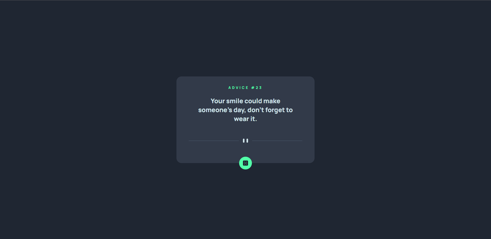

# Advice generator app solution

## Table of contents

- [Overview](#overview)
  - [The challenge](#the-challenge)
  - [Screenshot](#screenshot)
  - [Links](#links)
- [My process](#my-process)
  - [Built with](#built-with)
- [Author](#author)

## Overview

### The challenge

Users should be able to:

- View the optimal layout for the app depending on their device's screen size
- See hover states for all interactive elements on the page
- Generate a new piece of advice by clicking the dice icon

### Screenshot

### Links

- Live Site URL: [Live Site](https://advice-generator-ek67lyhuf-henkeldio.vercel.app/)

## My process

### Built with

- Semantic HTML5 markup
- CSS custom properties
- [React](https://reactjs.org/) - JS library

## Author

- Frontend Mentor - [@HenkelDio](https://www.frontendmentor.io/profile/HenkelDio)
- Linkedin - [Willian Henkel](https://www.linkedin.com/in/willian-henkel-b652b3205/)
